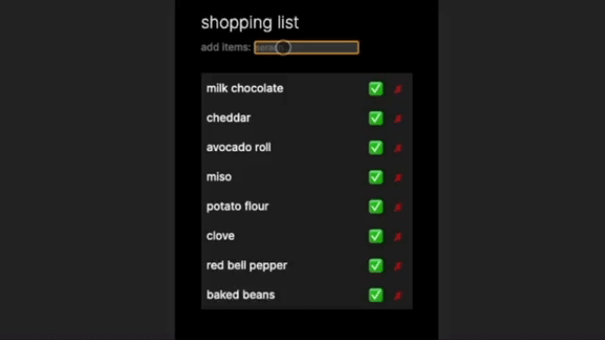

Frontendeval exercise

Link to preview: [Shopping List](https://shoppin-list.vercel.app/)

[link to the exercisse](https://frontendeval.com/questions/shopping-list)

I took some liberties with the UI to make it mobile friendly. I like my toggles close to my thumb :)

## Handling submission with Keyboard Event

I also accounted for query submission with 'Enter' keyboard event in addition to clicking on the dropdown selection. If, for example, user hits enter/return key after partial query shows results in the dropdown then the selection on the top will be added, presuming there is a match for the query. If no match found (i.e. 'kalkalash') then the query itself will be added to the list.

## Guarding query with space {' '}

Another edge case I decided to address. If one queries 'bac' then 'bacon' shows in the dropdown and hitting return key would submit 'bacon' even if there is a space after 'bac'. I made it so that the space {' '} would guard submitting from the dropdown selection and so we can put 'bac' on the List. What is 'bac'? I don't know but now it's on our list!

